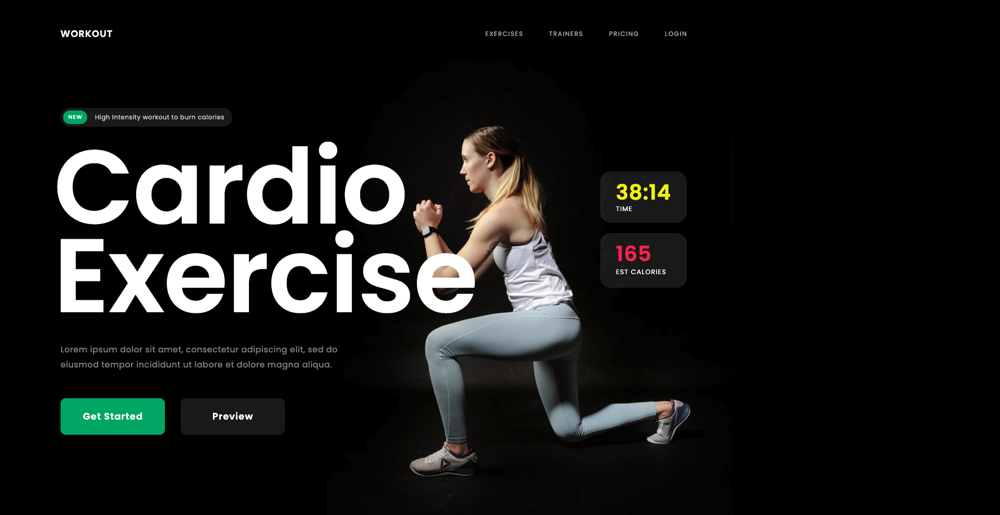

## Build React app with tailwindCSS
This is a repository for a FullStack Car catalogue app using React, NextJS-13, TailwindCSS, RapidApi 

# App link
https://react-app-tailwindcss-cardio-leading-iqndhleva.vercel.app/

# Technologies
- React js
- Beautiful layouts with TailwindCSS
- Create reusable components
  
# Screenshot

